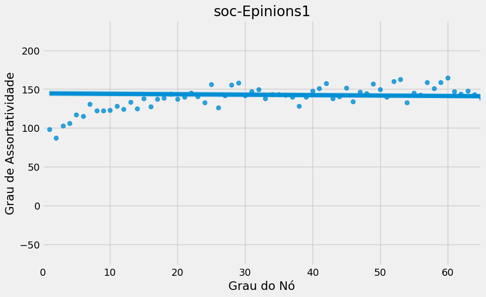
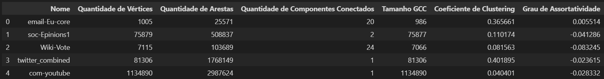

# Introdução aos Grafos e Assortatividade

Este README fornece uma breve introdução sobre grafos, assortatividade e como o grau dos nós influencia as demais características dos grafos. Também apresenta informações sobre cinco grafos específicos e, no final, inclui um espaço para um dataframe com métricas de grafos.

## Grafos

Um grafo é uma estrutura matemática que consiste em um conjunto de nós (ou vértices) e um conjunto de arestas (ou conexões) que ligam esses nós. Grafos são usados para representar uma variedade de relações e interações em várias áreas, como redes sociais, transporte, circuitos elétricos e muito mais.

## Assortatividade em Grafos

A assortatividade em grafos se refere à tendência de nós com características similares se conectarem uns aos outros. Em outras palavras, nós com graus semelhantes tendem a se ligar. Isso pode influenciar a estrutura e dinâmica de um grafo, afetando a propagação de informações, a resiliência da rede e muito mais.

## Influência do Grau dos Nós

O grau de um nó em um grafo representa o número de arestas conectadas a ele. A distribuição dos graus dos nós em um grafo pode afetar significativamente suas propriedades. Por exemplo, uma rede com uma distribuição de grau mais uniforme pode ser mais resiliente a falhas, enquanto uma rede com nós de alto grau pode ser mais eficiente na propagação de informações.

## Grafos Específicos

### email-Eu-core

Este grafo representa interações de e-mail na comunidade de pesquisa de uma universidade e pode ser encontrado em: [Dataset](https://snap.stanford.edu/data/email-Eu-core.html)

Com base no gráfico assortatividadeXgrau dos nós é possível afirmar que:

O gráfico é de dispersão e conta com uma linha de regressão, a fim de representar tendências. Nesse gráfico é exibida a relação entre o grau de um nó e o grau médio dos vizinhos desse nó na rede de e-mail de uma grande instituição de pesquisa europeia (assortatividade). A rede foi gerada usando dados de e-mail da instituição, onde existe arestsa (u, v) na rede se a pessoa u enviou, pelo menos, um e-mail para a pessoa v.

A linha de regressão no gráfico aponta para uma correlação positiva entre o grau de um nó e o grau médio dos vizinhos desse nó. Isso sugere que nós com muitas conexões tendem a se conectar com outros com também muitas conexões. Esse fenômeno é uma característica comum em redes com assortatividade positiva.

A dispersão dos pontos indica que há uma variação considerável no grau médio dos vizinhos para um dado grau de nó. Ou seja, há uma parte considerável dos dados que não seguem o padrão da assortatividade mencionada. 

Em resumo, a análise do gráfico sugere que a rede de e-mail da instituição de pesquisa exibe uma estrutura complexa, com padrões de conexão variados entre seus membros. 

### soc-Epinions1

Este grafo descreve interações de avaliação de produtos em uma rede social e pode ter seus dados disponibilizados em: [Dataset](https://snap.stanford.edu/data/soc-Epinions1.html)

Com base no gráfico assortatividadeXgrau dos nós é possível afirmar que 

### Wiki-Vote

Este grafo é derivado das votações de administração na Wikipedia e pode ter seus dados disponibilizados em: [Dataset](https://snap.stanford.edu/data/wiki-Vote.html)

Com base no gráfico assortatividadeXgrau dos nós é possível afirmar que 

### twitter_combined

Este grafo representa conexões entre usuários do Twitter e pode ter seus dados disponibilizados em: [Dataset](https://snap.stanford.edu/data/ego-Twitter.html)

Com base no gráfico assortatividadeXgrau dos nós é possível afirmar que 

### com-youtube

Este grafo modela conexões entre vídeos no YouTube e pode ter seus dados disponibilizados em: 

[Dataset](https://snap.stanford.edu/data/com-Youtube.html)

Com base no gráfico assortatividadeXgrau dos nós é possível afirmar que 

## Métricas de Grafos

Aqui estão algumas métricas comuns usadas para analisar grafos:

| Métrica              | Descrição                                         |
|----------------------|---------------------------------------------------|
| Número de Nós       | Total de nós no grafo                            |
| Número de Arestas    | Total de arestas no grafo                         |
| Grau Médio           | Média dos graus dos nós                          |
| Diâmetro             | Maior distância entre dois nós no grafo          |
| Coeficiente de Clustering Médio | Mede a tendência de formação de agrupamentos no grafo |
| Centralidade de Grau | Mede a importância dos nós com base em seu grau  |

Essas métricas ajudam a entender e as características de um grafo e, com base nelas, criou-se a seguinte tabela:

